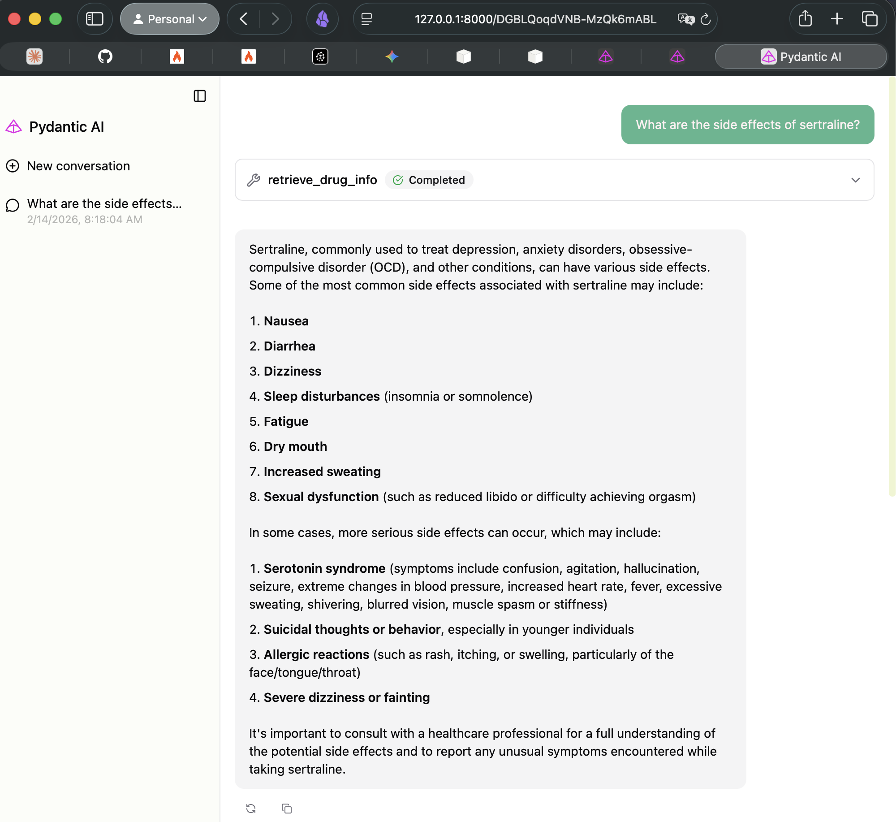
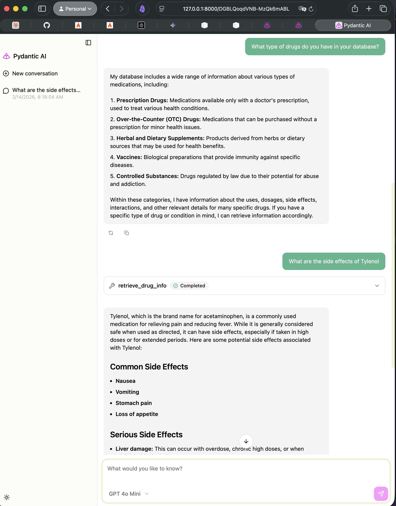

# Drug Info RAG with PydanticAI


A Retrieval-Augmented Generation (RAG) application that answers questions about pharmaceutical drugs using scraped medical data. Built with PydanticAI, LangChain, and PostgreSQL/pgvector.

## Features

- **Web Scraping**: Crawls and extracts drug information using Firecrawl from Mayo Clinic
- **Vector Storage**: Stores embeddings in PostgreSQL with pgvector extension
- **Intelligent Retrieval**: PydanticAI agent with automated similarity search tool
- **Web Chat Interface**: Interactive browser-based chat UI via `agent.to_web()`
- **Multiple Vector Store Options**: Supports both PostgreSQL/pgvector and Pinecone

## Architecture

```
┌──────────────┐     ┌──────────────┐     ┌──────────────┐
│ Firecrawl    │────▶│   Chunking   │────▶│  PostgreSQL  │
│  Scraper     │     │   (Recursive)│     │   + pgvector │
└──────────────┘     └──────────────┘     └──────────────┘
                                                  │
                                                  ▼
┌──────────────┐     ┌──────────────┐     ┌──────────────┐
│   Web Chat   │────▶│ PydanticAI   │────▶│   Similarity │
│     UI       │     │    Agent     │     │    Search    │
└──────────────┘     └──────────────┘     └──────────────┘
```

## Screenshots

### Web Chat Interface


*The PydanticAI web chat interface showing real-time streaming responses and conversation history*


*Tool call visualization showing when the agent retrieves information from the vector store*

## Prerequisites

- Python 3.12+
- PostgreSQL 14+ with pgvector extension (or Docker)
- OpenAI API key
- Firecrawl API key (optional, for re-scraping)

## Installation

```bash
# Clone the repository
git clone https://github.com/yourusername/drug-info-rag.git
cd drug-info-rag

# Create virtual environment
python -m venv venv
source venv/bin/activate  # On Windows: venv\Scripts\activate

# Install dependencies
pip install -r requirements.txt
```

## Environment Setup

Create a `.env` file in the project root:

```env
OPENAI_API_KEY=your_openai_key_here
PINECONE_API_KEY=your_pinecone_key_here  # Optional
```

## Database Setup

### Option 1: Docker (Recommended)

```bash
# Run PostgreSQL with pgvector
docker run -d \
  -e POSTGRES_PASSWORD=pass \
  -p 5432:5432 \
  -v postgres-data:/var/lib/postgresql/data \
  pgvector/pgvector:pg17
```

### Option 2: Local PostgreSQL

```bash
# Install pgvector extension
psql -d your_database -c "CREATE EXTENSION IF NOT EXISTS vector;"
```

## Usage

### Option 1: Command Line Interface

```bash
python main.py
```

The application will automatically:

1. Check if the vector store is populated (populate it if empty)
2. Start the web server

Then open your browser to: **<http://localhost:8000>**

Features:

- Real-time streaming responses
- Tool call visualization (see when retrieval happens)
- Conversation history
- Multi-turn dialogue support

## Project Structure

```
rag_pydanticai/
├── main.py                  # CLI + Web UI with PydanticAI and PGVector
├── data/
│   └── raw_documents/       # Scraped JSON files (auto-generated)
└── README.md               # This file
```

## How It Works

### 1. Data Scraping (Optional)

If you want to re-scrape data, the `scrape_and_save_data()` function in `main.py` handles this:

```python
def scrape_and_save_data():
    """Scrape drug information from Mayo Clinic and save to disk"""
    app = Firecrawl()
    
    # Crawl the base URL
    crawl_result = app.crawl(
        BASE_URL,
        limit=CRAWL_LIMIT,
        scrape_options={"formats": ["markdown"]},
    )
    
    # Extract URLs and batch scrape pages
    # Save results to data/raw_documents/
```

### 2. Vector Store Population

The application automatically checks if the vector store is populated. If not, it:

1. Loads JSON files from `data/raw_documents/`
2. Chunks text using RecursiveCharacterTextSplitter (500 chars, 50 overlap)
3. Embeds chunks using OpenAI's text-embedding-3-small (1536 dimensions)
4. Stores in PostgreSQL with pgvector

### 3. PydanticAI Agent Setup

**Dependencies (`RAGDeps`):**

```python
@dataclass
class RAGDeps:
    vector_store: PineconeVectorStore | PGVectorStore
```

> [!TIP]
> `RAGDeps` uses `@dataclass` as a simple dependency container for the vector store.

**Retrieval Tool:**

```python
@rag_agent.tool
async def retrieve_drug_info(ctx: RunContext[RAGDeps], query: str, k: int = 3) -> str:
    """Retrieve drug information from the vector store"""
    results = ctx.deps.vector_store.similarity_search(query, k=k)
    # Formats and returns context for the LLM
```

### 4. Agent Configuration

```python
rag_agent = Agent(
    "openai:gpt-4o-mini",
    deps_type=RAGDeps,
    system_prompt="""
    You are a helpful medical assistant specializing in drug information.
    Use the retrieve tool to find information about drugs when users ask questions.
    Always cite your sources and be accurate.
    """,
)
```

### 5. Web Interface

Convert agent to web UI:

```python
deps = RAGDeps(vector_store=vector_store)
app = rag_agent.to_web(deps=deps)
# Run with: uvicorn main:app --reload
```

## Key Implementation Details

### Chunking Strategy

Uses `RecursiveCharacterTextSplitter` with this priority order:

1. Paragraph breaks (`\n\n`)
2. Line breaks (`\n`)
3. Sentence ends (`.`)
4. Spaces
5. Any character

This preserves semantic coherence while staying within 500-character chunks.

### Vector Store Options

The code supports both:

- **PostgreSQL + pgvector**: Self-hosted, SQL integration, no vendor lock-in
- **Pinecone**: Managed service, automatic scaling (commented in code)

## Technologies Used

| Component | Technology |
|-----------|------------|
| **Agent Framework** | PydanticAI |
| **Vector Store** | PostgreSQL + pgvector (or Pinecone) |
| **Embeddings** | OpenAI text-embedding-3-small |
| **Chunking** | LangChain RecursiveCharacterTextSplitter |
| **Web Scraping** | Firecrawl |
| **Web Framework** | Starlette (via PydanticAI) + Uvicorn |
| **Data Validation** | Pydantic |

## Learning Resources

This project demonstrates:

- [Best Chunking Strategies for RAG in 2025](https://www.firecrawl.dev/blog/best-chunking-strategies-rag-2025)
- [How to build a production agentic app, the Pydantic Way](https://pydantic.dev/articles/building-agentic-application)

See `blog.md` for the implementation notes.

## License

MIT License - feel free to use this for your own projects!
